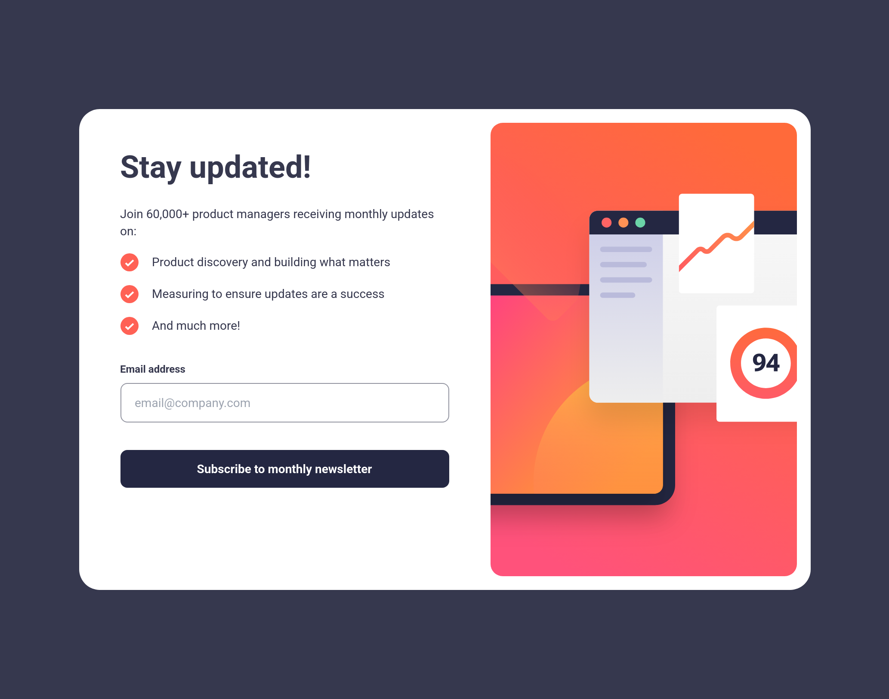

# Frontend Mentor - Newsletter sign-up form with success message solution

This is a solution to the [Newsletter sign-up form with success message challenge on Frontend Mentor](https://www.frontendmentor.io/challenges/newsletter-signup-form-with-success-message-3FC1AZbNrv). Frontend Mentor challenges help you improve your coding skills by building realistic projects. 

## Table of contents

- [Frontend Mentor - Newsletter sign-up form with success message solution](#frontend-mentor---newsletter-sign-up-form-with-success-message-solution)
  - [Table of contents](#table-of-contents)
  - [Overview](#overview)
    - [The challenge](#the-challenge)
    - [Screenshot](#screenshot)
    - [Links](#links)
  - [My process](#my-process)
    - [Built with](#built-with)
  - [Author](#author)

**Note: Delete this note and update the table of contents based on what sections you keep.**

## Overview

### The challenge

Users should be able to:

- Add their email and submit the form
- See a success message with their email after successfully submitting the form
- See form validation messages if:
  - The field is left empty
  - The email address is not formatted correctly
- View the optimal layout for the interface depending on their device's screen size
- See hover and focus states for all interactive elements on the page

### Screenshot

### Links

- Solution URL: [Solution code](https://github.com/Adnan0-IM/newsletter-sign-up-with-success-message)
- Live Site URL: [Live Demo](https://jovial-dasik-0fdaad.netlify.app/)

## My process

### Built with

- Semantic HTML5 markup
- Flexbox
- CSS Grid
- Mobile-first workflow
- [React](https://reactjs.org/) - JS library
- [TailwindCSS](https://tailwindcss.com/) - CSS Framework

## Author

- Website - [Adnan Iliyasu](https://adnan0-im.github.io/Frontend-Basics-Portfolio/)
- Frontend Mentor - [@Adnan0-IM](https://www.frontendmentor.io/profile/Adnan0-IM)
- Twitter - [@Adnan_imd](https://www.twitter.com/Adnan_imd)
